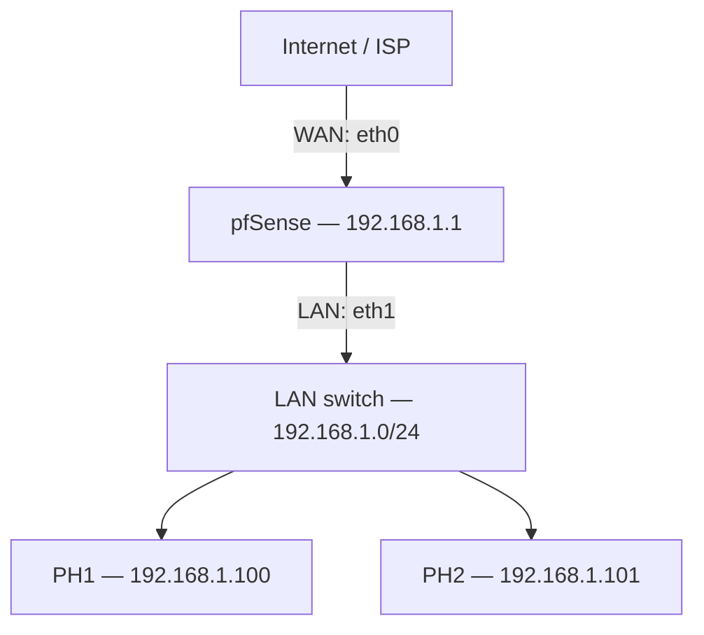

# pfSense Pharmacy Network Security

A portfolio case study documenting the design and hardening of a small pharmacy network using **pfSense**, **pfBlockerNG-devel**, **DNSBL**, **Kea DHCP**, and **Snort IDS/IPS**.

> **Sanitization notice:** This repository contains documentation and representative configuration only. Credentials, keys, public IP addresses, customer data, exported `config.xml` files, and other sensitive values are intentionally excluded.

## Project Overview

The goal was to place a pfSense firewall between the ISP/WAN connection and a small pharmacy LAN, provide controlled addressing and DNS resolution, reduce exposure to malicious infrastructure and unwanted domains, and add network intrusion detection/prevention.

### Core controls

- Stateful firewalling and NAT with pfSense
- LAN addressing and Kea DHCP
- pfBlockerNG-devel IPv4/IP reputation controls
- GeoIP-based blocking where operationally appropriate
- DNSBL domain filtering using curated feeds
- DNS policy controls to reduce direct external-DNS/DoH bypass
- Snort monitoring on LAN and WAN
- Snort GPLv2 Community and FEODO Tracker rules
- Dashboard monitoring and daily configuration backups
- Validation of DHCP, DNS filtering, firewall behavior, and IDS alerts

## Network Architecture




The firewall provides NAT, Kea DHCP, DNS Resolver, pfBlockerNG/DNSBL and Snort monitoring on LAN/WAN.

A standalone SVG version is available at [`diagrams/network-topology.svg`](diagrams/network-topology.svg).

## Addressing

| Component | Address / Interface |
|---|---|
| WAN | `eth0` |
| LAN | `eth1` |
| LAN network | `192.168.1.0/24` |
| pfSense LAN gateway | `192.168.1.1` |
| Kea DHCP pool | `192.168.1.100 - 192.168.1.199` |
| PH1 | `192.168.1.100` |
| PH2 | `192.168.1.101` |

The host addresses shown are private RFC1918 addresses and are retained only to make the lab/documentation reproducible.

## Repository Structure

```text
pfsense-pharmacy-network-security/
├── README.md
├── LICENSE
├── SECURITY.md
├── .gitignore
├── configs/
│   ├── firewall-policy.md
│   └── sanitized-config-notes.md
├── diagrams/
│   └── network-topology.svg
├── docs/
│   ├── 01-network-architecture.md
│   ├── 02-firewall-configuration.md
│   ├── 03-pfblockerng-dnsbl.md
│   ├── 04-snort-ids-ips.md
│   ├── 05-testing-validation.md
│   ├── 06-monitoring-backups.md
│   └── 07-github-upload.md
└── screenshots/
    ├── README.md
    ├── dashboard/
    ├── firewall-rules/
    ├── pfblockerng/
    └── snort/
```

## Implementation Summary

### 1. pfSense perimeter firewall
pfSense was used as the network gateway between WAN and the pharmacy LAN. The LAN was configured on `192.168.1.0/24` with `192.168.1.1` as the gateway. Stateful firewall policy controlled traffic entering and leaving the LAN.

### 2. DHCP and DNS
Kea DHCP supplied addresses from `192.168.1.100–192.168.1.199`. pfSense DNS Resolver was used as the controlled DNS path for LAN clients. DNS policy rules were used to reduce client bypass through direct external resolvers, with additional controls/testing for encrypted-DNS bypass.

### 3. pfBlockerNG-devel
pfBlockerNG-devel added IP reputation, IPv4 blocklists, GeoIP controls, and DNSBL filtering. DNSBL feeds included Shallalist/UT1-based categories used during the project.

### 4. Snort IDS/IPS
Snort was enabled for LAN and WAN monitoring. The deployment used community rules including Snort GPLv2 Community rules and FEODO Tracker Botnet C2 indicators. Alerts were reviewed and rules were tuned to avoid treating every alert as a confirmed incident.

### 5. Monitoring and recovery
The pfSense dashboard exposed system/interface status and security-package visibility. Configuration backups were scheduled/performed daily so the firewall could be recovered from configuration loss or failed changes.

## Security Design Principles

The project applies **defense in depth**: firewall policy limits connectivity, DNS/IP reputation controls reduce access to known unwanted infrastructure, and IDS/IPS provides another detection layer. Administrative access and anti-lockout behavior must be reviewed carefully before tightening management rules.

## Validation

The project validation checklist covers the following checks. Sanitized test results and screenshots are not yet included in this repository:

- Confirming PH1/PH2 received valid LAN addressing and gateway/DNS information
- Verifying normal Internet connectivity after firewall changes
- Testing DNS Resolver operation with `nslookup`
- Testing a safe domain expected to match an enabled DNSBL category/feed
- Confirming blocked DNS requests appeared in the relevant logs
- Reviewing pfBlockerNG IP/DNSBL activity
- Confirming Snort generated visible alerts from controlled test traffic/rule matches
- Checking LAN and WAN Snort interfaces after rule updates
- Verifying management access remained available after firewall-rule changes
- Confirming configuration backups could be located for recovery

See [`docs/05-testing-validation.md`](docs/05-testing-validation.md) for the detailed checklist.

## Scope

The final documented build focuses on the flat pharmacy LAN shown above. **VLAN segmentation and WireGuard were explored separately but are intentionally not represented as deployed controls in this final implementation.**

## Screenshots

See the [screenshot guide](screenshots/README.md). The `screenshots/` folders are placeholders for sanitized screenshots from the original deployment. Before committing an image, remove or blur:

- Public IP addresses
- Hostnames that identify a customer/site
- Usernames and email addresses
- MAC addresses where unnecessary
- API keys, tokens, certificates, private keys and passwords
- Package/feed credentials
- Customer or patient information

Never upload a raw pfSense `config.xml` from a real environment.

## Skills Demonstrated

`pfSense` · `Firewall Administration` · `Network Security` · `TCP/IP` · `Kea DHCP` · `DNS Security` · `pfBlockerNG` · `DNSBL` · `GeoIP Filtering` · `Snort` · `IDS/IPS` · `Threat Detection` · `Firewall Testing` · `Security Monitoring`

## Disclaimer

This repository is a sanitized technical portfolio case study. Example policies and addresses must be adapted and tested before use in another environment. Blocking feeds, GeoIP policies, IDS/IPS rules and encrypted-DNS controls can cause false positives or operational impact if deployed without testing.

## License

Documentation and original diagrams are provided under the MIT License. Third-party products, names and rule feeds remain subject to their respective licenses and terms.
