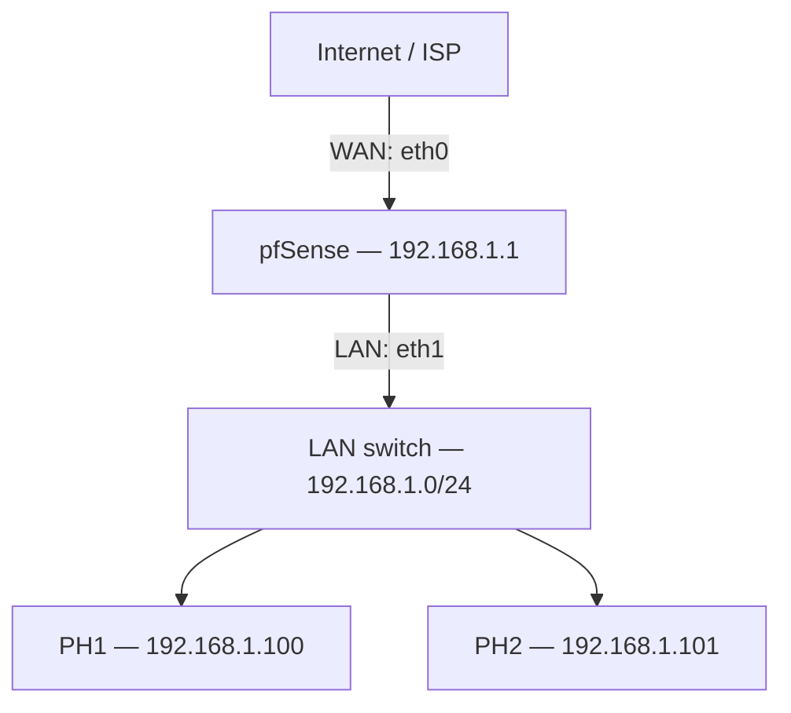
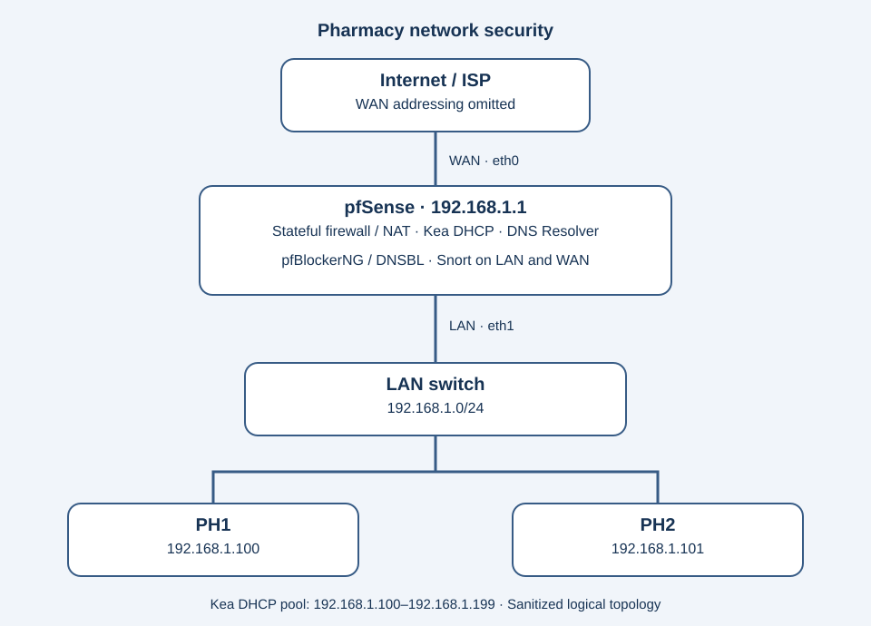

# Network Architecture

## Objective

Protect a small pharmacy LAN by placing pfSense at the network perimeter and centralizing firewalling, DHCP/DNS policy, reputation filtering and IDS/IPS visibility.

## Logical topology

## Interfaces

- **WAN:** `eth0`
- **LAN:** `eth1`
- **LAN network:** `192.168.1.0/24`
- **Default gateway:** `192.168.1.1`

## DHCP

Kea DHCP was configured with a pool of `192.168.1.100–192.168.1.199`.

## Scope note

VLANs and WireGuard were explored during development but are excluded from this final topology. The repository should not imply that those controls were deployed in the documented production/final build.
